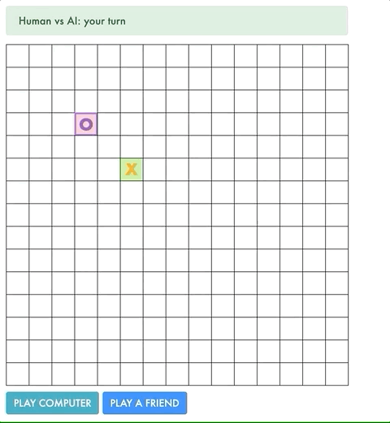

**Gomoku** is a Five in a Row board game. The AI player makes decisions using [minimax](https://en.wikipedia.org/wiki/Minimax) and [alpha-beta pruning](https://en.wikipedia.org/wiki/Alpha%E2%80%93beta_pruning).



### Features
- 3 door game and simulator for N rounds
- Switch/stay stats saved in LocalStorage

### Code Samples
#### Utility function
Since Gomoku is played on a 15x15 board, minimax would take a very long time to make a decision if the utility function only defined a score for winning and losing. To speed up the AI's decision, I limited the depth and used the idea of "threat sequences" to evaluate the state (in Gomoku, the best strategy is to make threats while also being aware of the threats your opponent is making). This paper was helpful in explaining Gomoku threat sequences: https://pdfs.semanticscholar.org/f476/00662cadb0975f9cfd7867389efedda6f873.pdf
<details>
  <summary>Example Code</summary>
  
  ```js
function utility(squares) {
    const winner = calculateWinner(squares);
    if (winner) {
        if (winner[0] === 'X') {
            return 1000000;
        } else {
            return -1000000;
        }
    } else {
        let bt, t, f, sf;
        [bt, t, f, sf] = [brokenThree(squares), three(squares), four(squares), straightFour(squares)];
        return 15 * (bt[0] - bt[1]) + 25 * (t[0] - t[1]) + 40 * (f[0] - f[1]) + 400 * (sf[0] - sf[1]);
    }
}
  ```
</details>

#### Minimax with alpha-beta pruning
**Minimax** is a strategy for finding the optimal move in a two-player, zero-sum game; I want to *minimize* the *maximum* possible loss. In other words, I want to make the best decision assuming my opponent even considers a decision that would make me worse off. This can be represented as a tree of player 1 and player 2's decisions until the game ends (or in this case, limited to how deep it searches to improve time).

**Alpha-beta pruning** is an optimization to stop expanding a decision branch if a node isn't worth considering. A node is worth considering if its utility, N, is between alpha (maximum lower bound) and beta (minimum upper bound). I'm not going to consider a move if it's possible my opponent's next move makes me worse off than an alternative move.
<details>
  <summary>Example Code</summary>
  
  ```js
function maxPlayer(squares, alpha, beta, depth) {
    if (terminal(squares) || depth === 2) {
        return [utility(squares), null];
    }
    let v = [alpha, null];
    for (let action of actions(squares)) {
        const minVal = minPlayer(result(squares, action, 'X'), v[0], beta, depth + 1);
        if (minVal[0] > v[0]) {
            v = [minVal[0], action];
            if (v[0] >= beta) {
                break;
            }
        }
    }
    return v;
}

function minPlayer(squares, alpha, beta, depth) {
    if (terminal(squares) || depth === 2) {
        return [utility(squares), null];
    }
    let v = [beta, null];
    for (let action of actions(squares)) {
        const maxVal = maxPlayer(result(squares, action, 'O'), alpha, v[0], depth + 1);
        if (maxVal[0] < v[0]) {
            v = [maxVal[0], action];
            if (alpha >= v[0]) {
                break;
            }
        }
    }
    return v;

}

function aiMove(state) {
    return minPlayer(state, -Infinity, Infinity, 0)[1];
}
  ```
</details>
